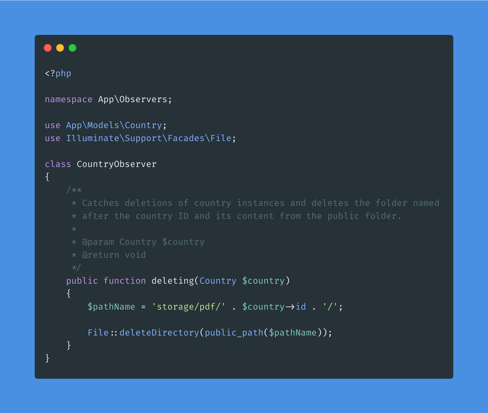

[Carbon](https://carbon.now.sh) is a web based code snippet creator, which you can use to create images of your source code. Carbon supports syntax highlighting for many languages and is highly customizable.

